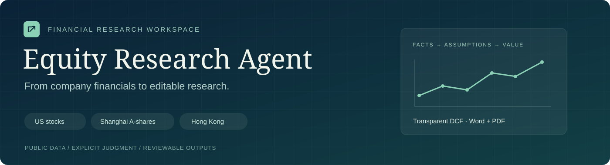
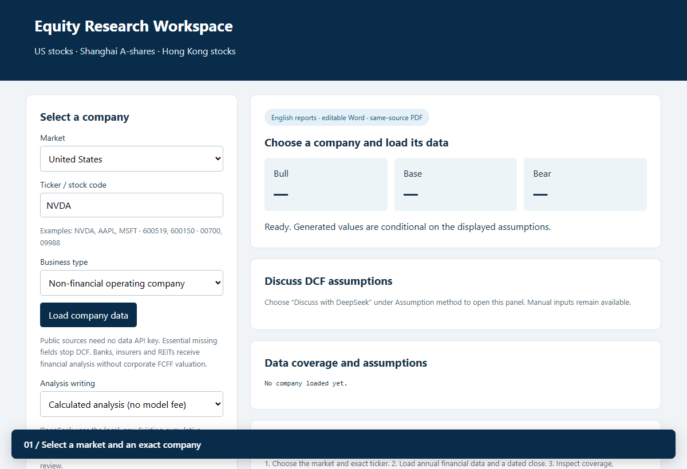
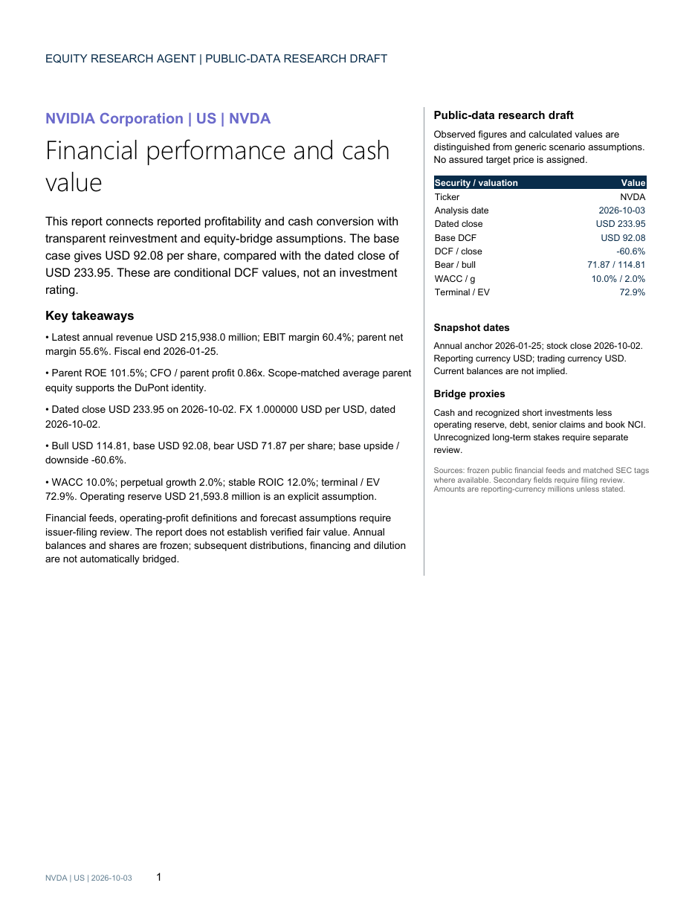
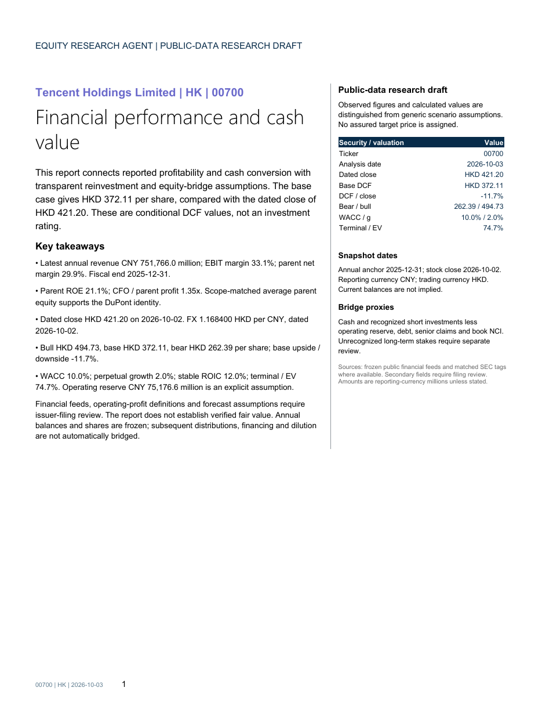
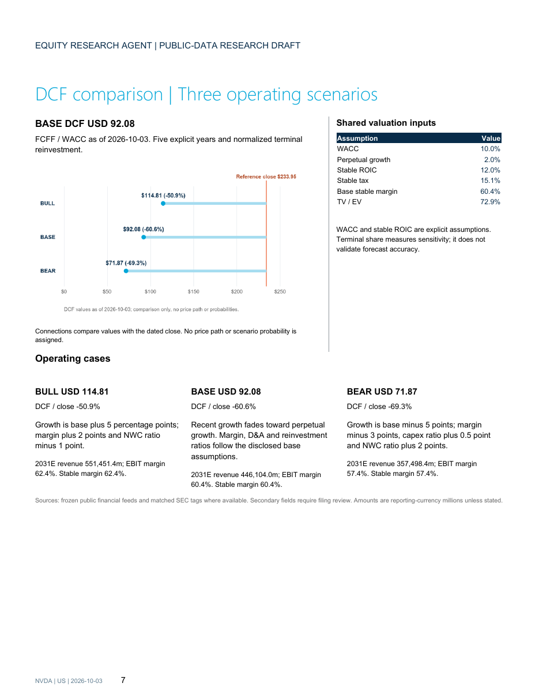
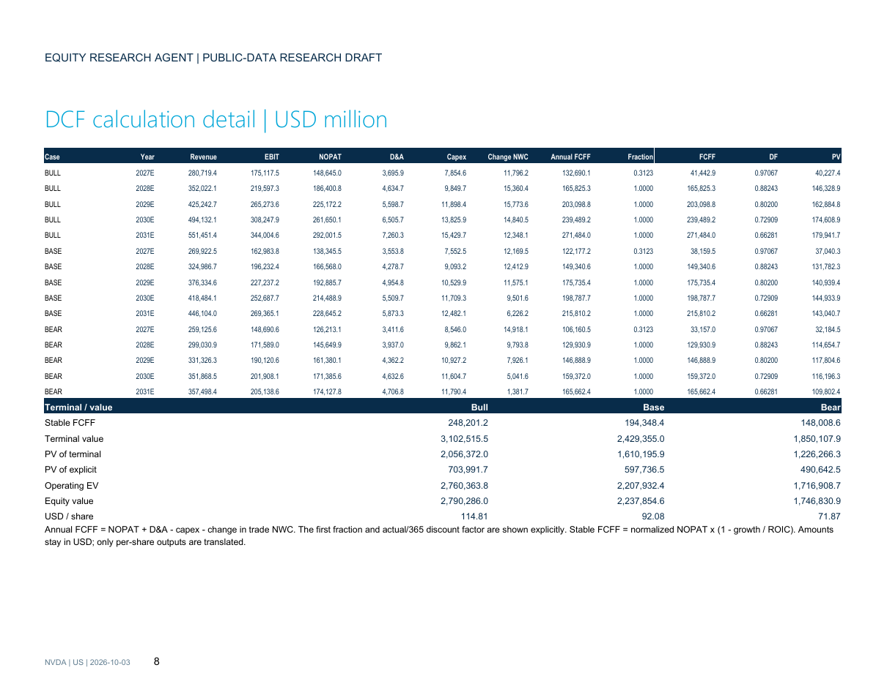
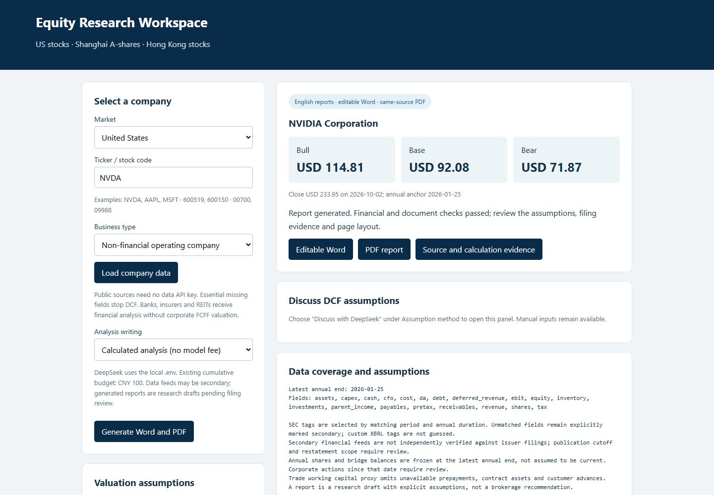
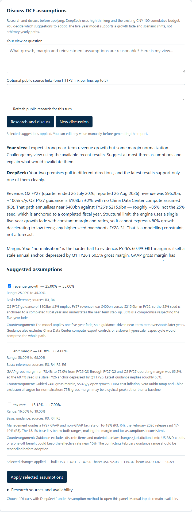
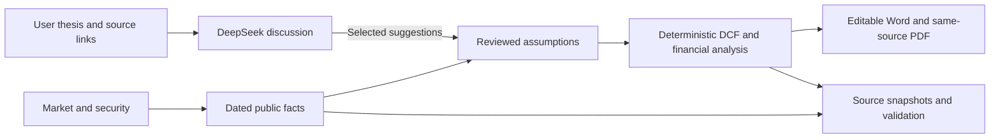

<p align="center">
  
</p>

<p align="center"><strong>US stocks · Shanghai A-shares · Hong Kong stocks</strong><br>English research reports · Editable Word · Same-source PDF · Transparent three-scenario DCF</p>

<p align="center"><a href="#sample-reports">Sample reports</a> · <a href="#the-workspace">The workspace</a> · <a href="#discuss-dcf-assumptions">DCF discussion</a> · <a href="#quick-start">Quick start</a> · <a href="docs/MULTI_MARKET_GUIDE_ZH.html">中文操作指南</a></p>

Equity Research Agent turns dated public financial data into an editable research report. Numerical **Key Takeaways stay intact**, followed by analysis of profitability, cash conversion and valuation drivers. Set DCF assumptions yourself, or discuss your thesis with DeepSeek and choose which suggestions to apply. A deterministic financial engine calculates the valuation.

### See the workflow

<p align="center"></p>

*A recorded walkthrough of the actual local UI, replaying accepted snapshots and a saved DeepSeek response. The sequence shows selection, existing report outputs and assumption review; it does not make a new live model call.*

## Sample reports

Three complete, downloadable examples. **Each contains 13 pages**, including financial analysis, a DCF visualization, calculation tables, sensitivity and source limitations.

<table>
  <tr><th>United States</th><th>Hong Kong</th><th>Shanghai A-share</th></tr>
  <tr>
    <td align="center"><a href="docs/reports/nvda/nvda.pdf"></a><br><strong>NVIDIA · NVDA</strong><br>USD reporting and valuation</td>
    <td align="center"><a href="docs/reports/tencent/tencent.pdf"></a><br><strong>Tencent · 00700</strong><br>CNY financials → HKD valuation</td>
    <td align="center"><a href="docs/reports/moutai/moutai.pdf"></a><br><strong>Kweichow Moutai · 600519</strong><br>CNY reporting and valuation</td>
  </tr>
  <tr>
    <td align="center"><a href="docs/reports/nvda/nvda.pdf">Read PDF</a> · <a href="docs/reports/nvda/nvda.docx">Download Word</a></td>
    <td align="center"><a href="docs/reports/tencent/tencent.pdf">Read PDF</a> · <a href="docs/reports/tencent/tencent.docx">Download Word</a></td>
    <td align="center"><a href="docs/reports/moutai/moutai.pdf">Read PDF</a> · <a href="docs/reports/moutai/moutai.docx">Download Word</a></td>
  </tr>
</table>

### Inside the report

The valuation page combines the three cash-flow scenarios, a dated stock close, the equity bridge and disclosed terminal assumptions. This is an **actual NVIDIA report page**; click to inspect it at full resolution.

<p align="center"><a href="docs/assets/nvda/dcf.png"></a></p>

<details>
<summary><strong>Inspect the cash-flow calculation page</strong></summary>
<br>

<p>Annual revenue, EBIT, tax, depreciation, capital expenditure, working capital and discounted cash flows are shown explicitly. Terminal reinvestment and the enterprise-to-equity bridge are part of the calculation.</p>
</details>

The sample date is **2026-10-03**. These are frozen public-data research drafts using disclosed scenario assumptions. Their conditional DCF values are not investment ratings or assured target prices.

## The workspace

Choose the market and exact security, inspect the loaded data, set assumptions and generate the English report. The interface shows company identity, reporting/quote currencies, scenario values, data coverage and output downloads.

<p align="center"></p>

| Capability | What you can do |
| --- | --- |
| Three markets | Select a US ticker, Shanghai six-digit code or Hong Kong stock code. |
| Explicit valuation | Set growth, margins, tax, reinvestment, WACC, perpetual growth, ROIC and equity-bridge inputs. |
| Scenario controls | Adjust bull/bear growth, margin, capex and working-capital shifts. |
| Editable delivery | Export Word and its matching PDF with assumptions and calculation detail. |
| Evidence | Preserve source snapshots, dates, currencies, hashes and validation summaries. |
| Offline replay | Recalculate the included financial snapshots without an LLM request. |

## Discuss DCF assumptions

Enter your thesis or question and optionally add public source links. DeepSeek reviews retrieved evidence, challenges the view and proposes assumptions with **ranges, reasons, references and counterarguments**. Select suggestions to apply; the financial engine shows the resulting valuation change. All fields remain manually editable.

<p align="center"></p>

*Interface screenshots replay the previously accepted NVIDIA data and DeepSeek validation response. No new API request was made for these images. The discussion example is separate from the frozen sample reports above.*

Manual inputs → discuss → inspect evidence → select suggestions → calculate → review the report. The model proposes and writes; the local engine computes the numbers. DeepSeek defaults to high thinking and a CNY 100 cumulative budget cap, with credentials read only from your local `.env`.

## Validation and scope

| Checked | Evidence |
| --- | --- |
| 3 reports / 39 pages | Every supplied page visually reviewed; original Word/PDF hashes retained. |
| 19 automatic checks per report | Financial recalculation, DuPont identity, currency conversion, chart values, document consistency and provenance. |
| 35 public repository tests | Financial engine, company reports, layout, assumption discussion, local HTTP routes and budget controls. |
| Exact frozen scenario replay | Bull, base and bear model results match the three saved examples. |
| Release privacy | Local credentials, personal discussion files, private reference documents and unrelated backtests excluded. |

[Release validation](docs/validation.json) · [NVIDIA checks](docs/reports/nvda/validation.json) · [Tencent checks](docs/reports/tencent/validation.json) · [Moutai checks](docs/reports/moutai/validation.json)

These checks establish calculation and document consistency. Secondary data fields still need issuer-filing reconciliation; annual balances may need updates for later dividends, financing and dilution. Generic assumptions require company-specific review. Corporate FCFF is disabled for banks, insurers, REITs and other financial-sector selections. New narrative/layout exports need their own visual review.

## Quick start

Python 3.10+; run from the extracted repository directory. Windows example:

```powershell
python -m venv .venv
.venv/Scripts/python.exe -m pip install -e ".[test]"
.venv/Scripts/python.exe -m equity_research_agent.cli serve --port 8766
```

Open `http://127.0.0.1:8766`. After installation, Windows users can launch **Start Workspace.cmd**. Live public-data collection needs internet but no separate data API key. To use DeepSeek, copy `.env.example` to `.env` and fill the key locally.

```powershell
# Frozen NVDA example, no model request, Word only
.venv/Scripts/python.exe -m equity_research_agent.cli company --market US --symbol NVDA --snapshot examples/nvda/company_snapshot.json --skip-pdf
# Test the public repository
.venv/Scripts/python.exe -m pytest tests -q
```

PDF export needs Windows, Microsoft Word and Poppler `pdftoppm` on PATH or `EQUITY_PDFTOPPM`. Other systems can create Word with `--skip-pdf`. The public layout is defined in code; it does not require a private reference document.

## How it is organized



```text
equity_research_agent/   Data collection, financial engine, discussion and local UI
configs/                Provider settings, execution limits and report layout
prompts/                English writing and assumption discussion instructions
examples/               Frozen three-market snapshots and calculation results
docs/reports/           Downloadable Word/PDF examples and validation summaries
tests/                  Offline and local-service regression checks
```

Company content, financial calculations and document formatting are separate, so the same pipeline can produce reports for different securities without rewriting a company-specific template.
